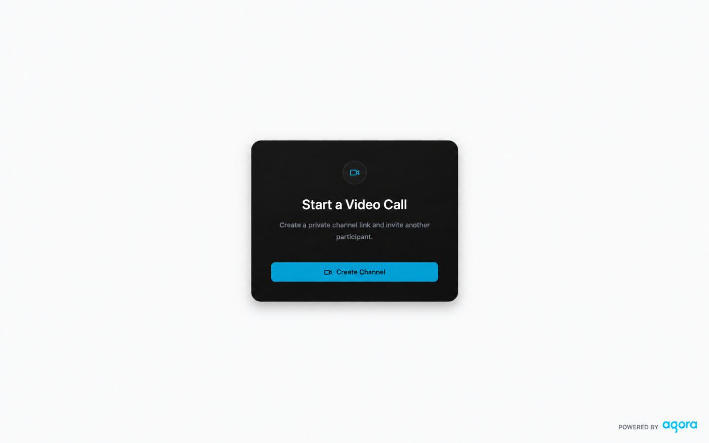

# Agora RTC Next.js Quickstart

A one-to-one audio and video calling starter built with Next.js and the Agora
RTC Web SDK. Create a room, enter your name, join from one client, then open
the same room URL from another independent client for complete RTC media.



## Prerequisites

- Node.js 22.x or 24.x (both tested in CI; Node 22 is the default in `.nvmrc`)
- pnpm 9.15.9 (preferred), or npm from the supported Node.js installation
- An Agora project with an App ID and primary App Certificate
- A supported browser with camera and microphone permission for live RTC
- Docker for the container workflow

## Run It

```bash
pnpm install --frozen-lockfile
cp env.local.example .env.local
```

If `pnpm --version` is unavailable or is not `9.15.9`, use npm without
creating a second lockfile:

```bash
npm install --package-lock=false
cp env.local.example .env.local
```

Set both Agora values in `.env.local`, then run:

```bash
pnpm run doctor
pnpm dev
```

With the npm fallback, run the same scripts as:

```bash
npm run doctor
npm run dev
```

Open the exact **Local** URL printed by the development server. The default is
[http://localhost:3000](http://localhost:3000), but Next.js may select another
available port when 3000 is already in use. Select **Create Room**, copy the
invite link, enter the name other participants should see, and select **Join
Call**. Camera and microphone access begins only after that action.

`pnpm dev` uses the Next.js 16 default Turbopack runtime. Do not force Webpack:
its cold cross-browser route compilation can reload an active room client and
clear the in-memory RTC session.

## Working From A Clone

```bash
git clone https://github.com/littleDogWang/agora-rtc-nextjs-quickstart.git
cd agora-rtc-nextjs-quickstart
pnpm install --frozen-lockfile
cp env.local.example .env.local
```

Add credentials to `.env.local`, run `pnpm run doctor`, and start with
`pnpm dev`. If pnpm is unavailable, use the npm commands above. The repository
does not create or bind an Agora project for you.

## Environment Variables

| Variable | Required | Owner | Description |
| --- | --- | --- | --- |
| `NEXT_PUBLIC_AGORA_APP_ID` | Yes | Public project configuration | Agora project identifier returned to the browser with its RTC token. |
| `NEXT_AGORA_APP_CERTIFICATE` | Yes | Next.js server only | Secret used by `POST /api/token`; never expose, log, bundle, or bake it into an image. |

Local development reads `.env.local`. Vercel uses project environment
variables. Docker receives both values only when the container starts.

## Use The Quickstart

### Single-client success

On the room screen, copy the invite link, enter your display name, and select
**Join Call**. The browser and Agora SDK request the system devices only after
the join command; open **Select devices** during the call when a manual choice
is needed.
A successful single-client run:

- issues an RTC token;
- joins the generated room with a unique RTC user account containing the display name;
- publishes every available local media track;
- shows the entered name with the local controls; and
- shows **Waiting for another participant**.

Single-client join is supported, but it does not prove remote media.

### Complete one-to-one experience

Open the exact same room URL in a second tab, window, browser profile, or device.
Enter a different display name and join independently in each client. Complete
RTC success requires two unique user accounts and actual remote audio and video
receipt in both directions.

When testing twice on one computer:

- wear headphones or mute one microphone to avoid feedback;
- allow both tabs to access the camera and microphone when prompted; and
- confirm both clients use the same `/room/<room-id>` URL.

## What You Get

- Next.js App Router UI matching the Agora agent starter visual shell
- named room entry without pre-join device capture
- visible invite actions before join and while waiting for a participant
- microphone and camera controls during the call
- direct `agora-rtc-sdk-ng` join, publish, subscribe, renewal, and cleanup
- URL-only UUID rooms with no database
- server-generated RTC publisher tokens
- single-client waiting and two-participant call states
- responsive desktop and mobile layouts
- Vercel and Docker production paths

## How It Works

The home page creates a UUID room URL. The room exposes the invitation URL and a
display-name field without accessing local devices. `POST /api/token` validates
the room and participant identity, creates or reuses a unique ASCII RTC user
account, and returns a non-cacheable RTC token.
The browser registers events, joins, creates and publishes local tracks, and
subscribes to remote audio and video independently. Token renewal reuses the
same room and user account.
Leaving releases listeners, tracks, devices, and the RTC client.

See [ARCHITECTURE.md](ARCHITECTURE.md) for the canonical topology and lifecycle.

## Commands

### Setup

```bash
pnpm install --frozen-lockfile # install the locked dependency graph
pnpm run doctor        # check Node, pnpm, required files, and local env values
```

### Development

```bash
pnpm dev               # Next.js development server
pnpm run start         # start an existing production build
pnpm run test:watch    # Vitest watch mode
```

### Quality

```bash
pnpm run lint          # ESLint
pnpm run typecheck     # TypeScript without emit
pnpm test              # unit and component tests
pnpm run build         # production build
```

### CI / Pre-ship

```bash
pnpm run verify        # lint + typecheck + test + build
```

## Architecture

The browser owns UI state, local devices, and one RTC client. The Next.js Node
process owns token generation and the App Certificate. Agora owns channel and
media transport. The application has no room database or persistent backend.

Read [ARCHITECTURE.md](ARCHITECTURE.md) for component, API, lifecycle, Vercel,
Docker, and production boundaries.

## Repository Map

- `app/api/token/route.ts` - RTC token issue and renewal route
- `app/room/[roomId]/page.tsx` - validated room entry
- `components/room-experience.tsx` - named join and call state machine
- `components/room-experience-loader.tsx` - browser-only RTC SDK boundary
- `components/join-room.tsx` - display-name and invitation form
- `components/invite-button.tsx` - shared invitation copy and feedback
- `components/call-view.tsx` - one-to-one call layout
- `lib/rtc-session.ts` - Agora client lifecycle
- `lib/media-devices.ts` - partial media and device handling
- `lib/rtc-identity.ts` - display-name validation and RTC account encoding
- `tests/` - token, RTC, device, and UI contracts
- `docs/ai/` - progressive coding-agent context
- `AGENTS.md` - coding-agent loading and implementation constraints

## Troubleshooting

- **Credentials are not configured:** confirm both `.env.local` values are non-empty, then restart Next.js.
- **pnpm is missing or has the wrong version:** use `npm install --package-lock=false`, then run scripts with `npm run <script>`.
- **Camera or microphone permission was denied:** allow the site in browser permissions and select **Join Call** again.
- **Only one media type works:** audio-only or video-only join is supported when one device is unavailable.
- **No remote video:** confirm both clients use the same room URL and the remote camera is enabled.
- **No remote audio:** confirm the remote microphone is enabled and browser playback is not muted.
- **A second tab cannot use a device:** allow both tabs in browser permissions, or choose another available camera or microphone.
- **Container starts but RTC fails:** verify both runtime credentials are present and valid; HTTP startup alone is not RTC evidence.

## Deployment

### Vercel

[](https://vercel.com/new/clone?repository-url=https%3A%2F%2Fgithub.com%2FlittleDogWang%2Fagora-rtc-nextjs-quickstart&project-name=agora-rtc-nextjs-quickstart&repository-name=agora-rtc-nextjs-quickstart&env=NEXT_PUBLIC_AGORA_APP_ID%2CNEXT_AGORA_APP_CERTIFICATE&envDescription=Agora+credentials+needed+to+run+the+RTC+quickstart&envLink=https%3A%2F%2Fgithub.com%2FlittleDogWang%2Fagora-rtc-nextjs-quickstart%23run-it&demo-title=Agora+RTC+Next.js+Quickstart&demo-description=One-to-one+audio+and+video+calling+with+Agora+RTC+and+Next.js)

The Vercel account must have repository access. Configure both environment
variables, deploy, verify single-client join, then use two independent clients
for complete media evidence.

### Docker

Build the reusable image without Agora credentials:

```bash
docker build --tag agora-rtc-nextjs-quickstart .
```

Inject the App ID and server-only certificate when the container starts:

```bash
docker run --rm --publish 3000:3000 \
  --env NEXT_PUBLIC_AGORA_APP_ID=your_app_id \
  --env NEXT_AGORA_APP_CERTIFICATE=your_app_certificate \
  agora-rtc-nextjs-quickstart
```

Open `http://localhost:3000`. Image build, process startup, and HTTP availability
prove packaging only; they do not prove RTC token validity or media.

## Security

The App Certificate remains server-side and token responses are non-cacheable.
The token route validates room IDs, display names, and RTC user accounts but has no application login, room
authorization, server-controlled identity, or rate limiting.

Use a dedicated demo project. Do not attach production credentials to untrusted
preview environments. Remove public demos and rotate the App Certificate when
they are no longer needed. Production use requires authentication,
authorization, abuse controls, and monitoring.

## More Documentation

- [Agent development guide](AGENTS.md)
- [Architecture](ARCHITECTURE.md)
- [Contributing](CONTRIBUTING.md)
- [AI repository card](docs/ai/L0_repo_card.md)
- [Agora Video Calling React Quickstart](https://docs.agora.io/en/video-calling/get-started/get-started-sdk?platform=react-js)
- [Agora RTC Web SDK API](https://api-ref.agora.io/en/video-sdk/web/4.x/index.html)
- [Deploy a Token Server](https://docs.agora.io/en/video-calling/token-authentication/deploy-token-server)

## License

Released under the [MIT License](LICENSE).
